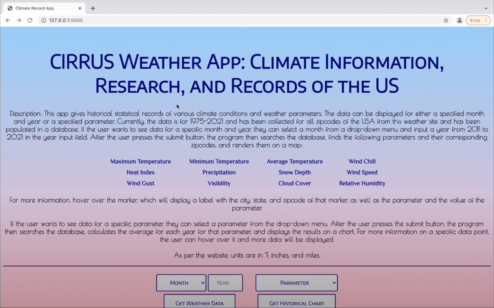
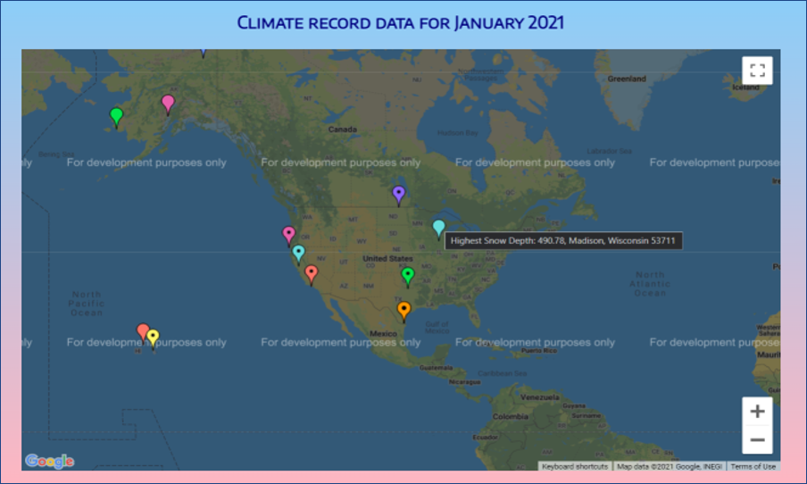
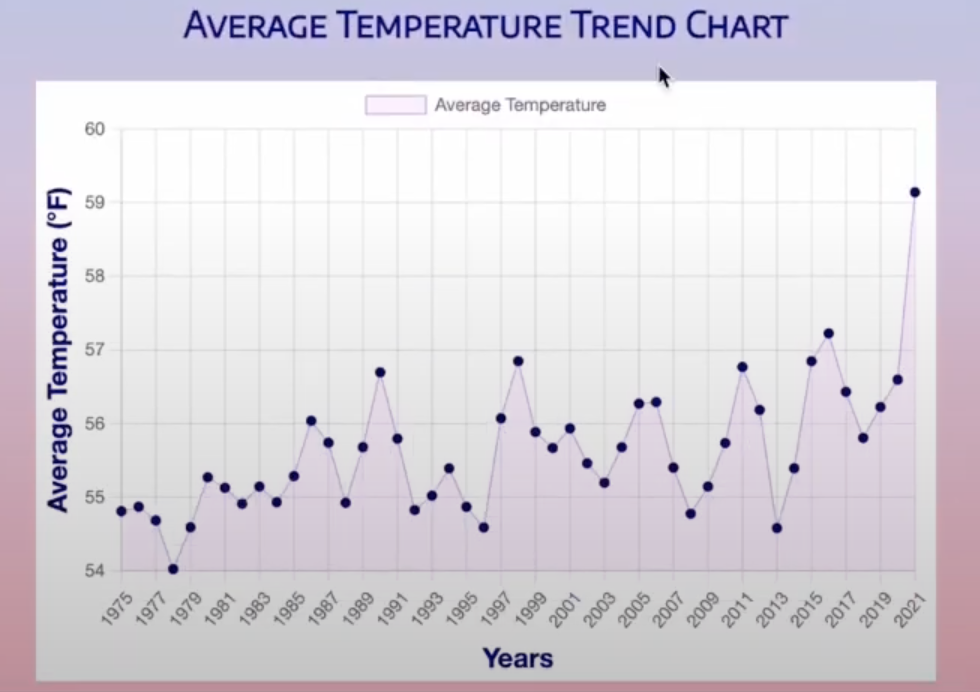
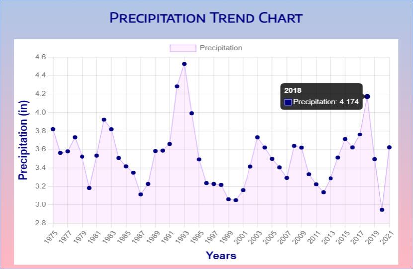

# CIRRUS Weather App

## Climate Information, Research, and Records of the US

### Video Demo: https://www.youtube.com/watch?v=k09VdqbKnMo

### Description:

I have developed this app called CIRRUS (Climate Information, Research, and Records of the US). The app displays interesting statistical weather records and trends which can be used in climate related research including study of global warming.

This app was submitted for the 2021 Congressional App Challenge. I just wanted to share in case anyone finds it interesting.

#### Languages Used:
- Python (Flask, Beautiful Soup, urllib/requests)
- SQL
- HTML
- CSS
- JavaScript
- Jinja2 templating

#### Additional Tools used and API accesses done:

- Zip Codes To Go (for collecting all zip codes of the USA)
- Visual Crossing Weather API (for collecting statistical weather summary data)
- Google Maps JavaScript API (for rendering the map with the output data)
- Google Geocoding API (for converting zip code to map location latitude/longitude)

#### Data Collection:

1. The program collects all the zip codes for each state (from the website https://www.zipcodestogo.com/) and stores them in a database along with city and state information. Since the data is in html format, Python BeautifulSoup library is used to extract information.

2. Next the program fetches weather data from https://www.visualcrossing.com/weather-api. This data is collected from 1975 to September 2021 and the data is in CSV format, so Python CSV module is used for processing. [NOTE: A subscription needs to be purchased for this.]

For each zip code, the following monthly summary data is collected: *Max Temperature, Min Temperature, Average Temperature, Wind Chill, Heat Index, Precipitation, Snow Depth, Wind Speed, Wind Gust, Visibility, Cloud Cover, and Relative Humidity.*

Data collection is a one-time activity and once done, it can be skipped for subsequent runs.

#### Data Processing and Visualization:

Data is presented on the web page based on user query. There are two query options:

1. **Min-Max records for various weather parameters:**
The user can select a month from a drop-down menu, enter a year, and click the Get Weather Data button. The program then searches the database, finds locations for parameters such as highest temperature, max rainfall, etc. for that year and month across the entire country, and displays them all in one map. For more information, the user can hover over the marker, which will display a label with the city, state, and zip code of that marker, as well as the parameter and the value.

2. **Historical chart for any specific parameter:**
For this query option, select a specific parameter, such as "Average Temperature", from the drop-down menu, and click the Get Historical Chart button. We now get the US average temperature chart. Ignoring 2021 (since we don't have data for the entire year), we can see an increasing trend in temperature from 54.8&deg;F in 1975 to 56.6&deg;F in 2020.

#### File Descriptions:

**README.md**: The README file.

**app.py**: The main python file of the application (contains all the functions and Flask routes).

**datalib.py**: Supplemental data (constants, variables, literals) all in one file.

**bs4/**: If Beautiful Soup module is not installed, then the package can be downloaded and unarchived in order to use the library.

**styles.css**: Stylesheet for the HTML files.

**chart.html**: HTML file for displaying chart results.

**index.html**: App home page.

**layout.html**: Common HTML constructs kept in one file to avoid clutter due to repetition and keep all other HTML files clean.

**results.html**: HTML file for processing and visualization of query results.

**weatherdb.sqlite**: The database that stores all the database tables. This database is not included (too large to upload). 

**zipcount.json**: Contains the zip code count for each state. Used to determine whether all zip codes for the current state have been collected or not.

Here is the file/directory tree of all files.

    CIRRUS:~$tree
    ├── README.md
    ├── app.py
    ├── datalib.py
    ├── static
    │ └── styles.css
    ├── templates
    │ ├── chart.html
    │ ├── index.html
    │ ├── layout.html
    │ └── results.html
    ├── weatherdb.sqlite
    └── zipcount.json

In order to run the program, first export the API keys as below.

For Linux/Mac operating systems:

    $ export API_KEY_GEO=<YOUR_API_KEY_HERE>
    $ export API_KEY_WEA=<YOUR_API_KEY_HERE>

For Windows operating systems:

    PS C:\> $Env:API_KEY_GEO = <YOUR_API_KEY_HERE>
    PS C:\> $Env:API_KEY_WEA = <YOUR_API_KEY_HERE>

Also, be sure to have a Maps API key to see the map on the results page. Insert it into the below line of code (in the program, there's already a key there, but that one will not work):

    

Then run flask. Access the website by clicking on the given URL.

In MacOS/Linux:

    $ flask run
    * Serving Flask app "app.py" (lazy loading)
    * Environment: development
    * Debug mode: off
    * Running on <url> (Press CTRL+C to quit)
    * Restarting with stat

In Windows:

    PS C:\> flask run
    * Environment: production
    WARNING: This is a development server. Do not use it in a production deployment.
    Use a production WSGI server instead.
    * Debug mode: off
    (date/time) - * Running on <url> (Press CTRL+C to quit)

### Screenshots:

#### App Homepage:

#### Get Weather Data Query Results:

#### Get Historical Chart Query Results (Avg Temperature):

#### Get Historical Chart Query Results (Precipitation):

### NOTES:

1. Since there are many locations displayed and they can be spread across all over the country, the map is centered at the center of the USA (latitude: 39.50, longitude: -98.35) so all markers can fit on the screen properly.
2. For displaying the markers, zip codes cannot be used for locations. Therefore, the Google Geocoding API is used to fetch latitude/longitude information for the zip codes.
3. For a more comprehensive study on global warming, we have to take the entire world’s data into consideration and more precise and extensive data mining is needed. However, even with limited data, we can clearly see the gradient of rise in temperature.
4. Not just for temperature and global warming, this app can also be used to study all other parameters mentioned earlier such as precipitation, snow depth, etc.
5. I noticed sometimes the data returned by Visual Crossing website had values that did not seem right. Also, some of the weather parameters for some months may be missing sometimes. So please be aware of this in case some data doesn’t make sense or is missing. However, with a large dataset, any such anomalies average out and do not have much impact on the overall results.
